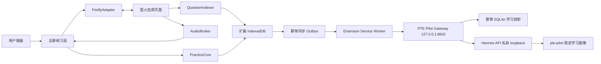

# PTE Pilot WFD 浏览器扩展设计规格

- 状态：已批准
- 日期：2026-07-15
- 产品形态：Chrome Manifest V3 Extension
- 使用范围：个人学习、本机优先、仅用于萤火虫 PTE 练习页面
- 目标页面：`https://www.fireflyau.com/ptehome/exercise?pageSource=yc`

## 1. 背景与已验证事实

萤火虫网站负责账号登录、周预测题库、当前题目、原始音频、答案揭示和题目切换，但现有练习界面不适合高强度 WFD 键盘训练。PTE Pilot 在同一浏览器标签页中提供一个全屏练习层，把网站变成内容源和状态源，同时提供低延迟输入、全键盘控制、错误词记录和长期学习记忆。

当前已通过登录态页面观察到：

- 周预测 WFD 页面显示类似 `12/192` 的当前位置和总数。
- 页面具有上一题、下一题、评分、答案和原始输入区域。
- 页面没有稳定可直接复用的 `<audio>` 元素；音频由页面动态请求。
- 实际音频来自 `https://upload.fireflyau.com/.../*.mp3`，响应为 `audio/mpeg`，支持分段请求。
- 本次规格落档时浏览器登录态已经过期，因此“是否存在一次返回整套周预测题目元数据的接口”尚未在认证状态下确认。

最后一项不是待定设计：实现将采用能力阶梯。优先探测并验证结构化列表接口；不可用时自动退化到页面题号选择器或受控逐题遍历；仍不可用时采用随练随收集。系统不得把 `192` 写死，必须以网站当期报告的总数 `N` 为准。

## 2. 产品目标

PTE Pilot 的核心目标是形成一条稳定、快速、无需鼠标的 WFD 练习闭环：

1. 获取当前周预测的题目标识和原始音频。
2. 在扩展全屏练习层中播放、输入、提交、查看确定性差异并切题。
3. 保持扩展题目、音频和萤火虫原页面三者严格同步。
4. 自动记录错词、作答耗时、重播次数和掌握情况。
5. 使用 Hermes 的长期记忆支持跨会话复习排序；Hermes 不参与实时输入、播放、评分或导航。
6. Hermes 离线、超时或未启动时，核心练习完整可用。

## 3. 非目标

首个产品版本明确不包含：

- AI 错误解释、学习总结、聊天窗口或 AI 生成题目。
- 绕过登录、付费、验证码、限流或站点访问控制。
- 批量下载、永久保存或再分发萤火虫音频与完整题库。
- 在提交前展示、保存、记录或发送正确答案。
- 用扩展取代萤火虫账号体系或制作独立移动/桌面 App。
- 正式考试环境中的辅助使用。

## 4. 核心决策

### 4.1 同标签页全屏覆盖层

主界面使用注入萤火虫练习页的 Shadow DOM 全屏覆盖层。浏览器 popup 和 side panel 只可用于设置或诊断，不承担主练习界面。

该结构让原页面继续维持登录、播放器、题目状态和站点内部逻辑；扩展通过适配器调用原生控件。用户关闭覆盖层后仍能直接看到原页面并诊断同步状态。

### 4.2 网站是内容与导航真源

扩展不私自构造“下一题”。每次切题都驱动萤火虫原生上一题、下一题或题号选择行为，然后等待原页面确认题目标识已变化。扩展只在验证完成后解锁输入。

### 4.3 扩展输入是当前草稿真源

练习期间不把每个按键实时镜像进网站输入框。扩展的原生 `<textarea>` 保存当前草稿；提交时一次性写入网站输入框并触发原生事件。这样可避免框架重渲染、网站监听器和网络行为影响打字延迟。

### 4.4 正确答案只能提交后进入短暂处理链

提交前，正确答案不得进入扩展 UI、IndexedDB、日志、Hermes 或内容脚本消息。提交后仅在网站已经为同一道题公开答案时读取，用于本地确定性对齐；切题时立即清除答案上下文。

### 4.5 AI 只排序，不控制页面

本地规则先生成允许复习的候选题 ID；Hermes 只对该候选集合排序，并返回结构化 `rankedQuestionIds`。扩展验证返回值属于候选集合后才采用。Hermes 无权点击页面、播放音频、提交答案或决定候选集合之外的题目。

## 5. 总体架构



### 5.1 组件职责

#### FireflyAdapter

- 识别当前题目 ID、`x/N` 位置、输入框、上一题、下一题、评分和答案控件。
- 优先使用可见文字、ARIA 属性、输入语义和题目标识等稳定信号。
- 禁止依赖哈希 CSS 类、`nth-child`、React/Vue 私有实例或打包器内部结构。
- 用 `MutationObserver` 发现页面变化，包括用户在原页面手动切题。
- 暴露 `next`、`previous`、`selectQuestion`、`writeAnswer`、`score`、`revealAnswer` 和 `redo` 等语义操作；只有站点确实提供相应能力时才启用。
- 所有操作携带预期题目 ID 或预期位置并返回可验证结果，不以“点击成功”代表“切题成功”。

#### MainWorldBridge（按需启用）

- 当 DOM 无法提供足够元数据时，在页面主世界中旁路观察同源 `fetch`/XHR。
- 克隆响应后只传递白名单字段，不修改请求、响应或站点业务逻辑。
- 即使响应包含答案字段，提交前也必须丢弃这些字段，禁止转发响应原文。
- Bridge 与隔离世界使用每次页面装载生成的 nonce、固定消息类型和字段 schema；拒绝来自页面任意脚本伪造的高权限请求。

#### QuestionIndexer

- 建立当期周预测的轻量题目索引。
- 执行能力阶梯和断点续传，记录索引进度、失败原因与版本。
- 比较当期有序题目 ID 哈希，识别新增、删除和顺序变化。
- 只存元数据，不保存音频二进制或未提交答案。

#### AudioBroker

- 将当前题目与网站发出的真实音频请求绑定。
- 管理解析、预载、播放、暂停、重播和失效。
- 无法安全验证时退回网站原始播放器，并明确显示音频错误状态。

#### AnswerGate

- 管理提交前答案隔离、整句写回、评分调用、答案揭示验证和确定性差异计算。
- 确保读取的答案属于同一 `questionId`、同一导航世代和本次提交世代，而不是同题上一次尝试留下的答案。

#### PracticeCore

- 管理题目草稿、尝试记录、错词、复习候选生成、练习模式与考试模式。
- 所有即时决策都有本地确定性实现，不依赖 Hermes。

#### HermesConnector

- 仅由扩展 Service Worker 调用窄接口的 PTE Pilot Gateway，不让页面或 content script 直接接触 Hermes 的通用 Agent API。
- 通过确定性端点执行幂等事件同步，通过受约束端点请求 Hermes 候选排序。
- 隔离 Gateway token、Hermes 上游凭据、超时、重试和返回值验证。

### 5.2 全屏练习层信息结构

覆盖层只显示当前练习所需信息：顶部为模式、周预测版本、题号 ID、`x/N` 和同步状态；中央为音频状态、播放进度和原生 `<textarea>`；提交后下方显示词级差异、错词和下一步快捷键；底部状态条显示 Hermes、索引和站点适配器状态。

提交前不显示正确句子。WFD 的核心题目内容由原始音频承载，扩展可显示网站公开的题号、难度、标签和通用作答说明。覆盖层必须能用键盘关闭以返回仍然存活的原页面。

## 6. 题目索引设计

### 6.1 能力阶梯

索引按以下顺序执行：

1. **结构化列表接口**：在认证页面观察网络请求，寻找当期周预测列表接口。只有通过 schema 校验，并能用当前页面题目 ID、位置和总数交叉验证后才采用。
2. **题号选择器或受控遍历**：解析网站题号选择器；若不存在，则一次只调用一次网站原生下一题。每题保存检查点，等待 DOM 稳定后继续。遇到重复题目、达到网站总数或安全停止条件时结束。
3. **随练随收集**：用户正常切题时逐步建立索引，不主动遍历未访问题目。

索引必须支持暂停、恢复和取消。不得并发快速切换页面，不得隐藏验证码或绕过限流。遇到 `401`、`403`、`429`、CAPTCHA、登录页或结构不一致时立即暂停，并向用户报告原因。

受控遍历在独占索引模式运行：先保存起始 `questionId`、位置和草稿，并锁定练习提交。若题号选择器可用，先验证跳到第 1 题；否则从当前位置遍历到末题，再通过网站原生能力回到第 1 题并扫描到起始题前一题。只有收集到 `N` 个唯一题目且位置覆盖 `1..N` 才算完整。结束、取消或失败后必须验证恢复起始题和草稿；无法安全回到第 1 题时，不声称获得完整索引，直接保留部分快照或使用随练随收集。

### 6.2 元数据模型

```ts
interface IndexedQuestion {
  predictionEdition: string;
  questionId: string;
  sitePosition: number;
  siteTotal: number;
  tags: string[];
  mediaLocator?: string;
  discoveredAt: string;
  schemaVersion: number;
}

interface IndexSnapshot {
  predictionEdition: string;
  orderedQuestionIds: string[];
  siteTotal: number;
  completeness: "complete" | "partial";
  checkpointPosition?: number;
  schemaVersion: number;
}
```

`mediaLocator` 只用于重新定位当期媒体请求，不代表永久有效的可下载 URL。索引不保存完整题干、正确答案或音频 Blob。

### 6.3 周预测更新

每次进入周预测页时，扩展维护带 `completeness` 的快照。只有覆盖 `1..N` 的 `complete` 快照才计算 `predictionEdition + orderedQuestionIds` 哈希，并据此判断新增、移除和重排；`partial` 快照只能合并新发现的题目，不能推断删除或全局顺序变化。历史作答按稳定 `questionId` 保留；完整快照确认已移除的题目不再进入本周候选，但历史错误记忆不删除。

## 7. 原始音频绑定

### 7.1 音频发现

以下信号只用于发现媒体候选，不能单独证明音频属于当前题：

1. 网站播放器当前 `currentSrc` 或可验证媒体属性。
2. 页面 Resource Timing 中近期媒体资源。
3. `chrome.webRequest` 观察 `upload.fireflyau.com` 的媒体请求。

因果绑定流程为：确认当前题号后创建新的捕获令牌，清空候选缓冲，再主动调用该题网站原生 Play。只接受由这次动作时间窗产生、且唯一的媒体候选；若存在多个不同候选，立即进入 `AUDIO_ERROR`，不得选择“最像”的一个。Resource Timing 只能作为旁证，不能单独建立绑定。缓存导致没有新网络请求时，只有同题播放器的 `currentSrc` 在本次 Play 动作中被设置或明确验证后才可复用；否则继续控制网站原播放器，不复制 URL。

扩展权限只允许观察必要域名。每个候选媒体还必须校验：

- 主机为允许的音频域名。
- 响应类型或资源类型与音频一致。
- 请求发生在当前导航世代的允许时间窗内。
- 捕获令牌仍属于当前题目。

### 7.2 防串题绑定

每次题目稳定后创建：

```ts
interface AudioBindingKey {
  questionId: string;
  navigationEpoch: number;
  captureToken: string;
}
```

任何旧世代回调都必须丢弃。导航开始、`navigationEpoch` 递增后立即停止播放、撤销旧异步任务、释放旧对象 URL、清空旧音频和答案绑定。只有题目标识已确认且音频候选通过校验时，状态才能进入 `READY`。

### 7.3 缓存边界

当前题音频可在内存中预载以降低按键到播放延迟。扩展不批量抓取全部音频，不将音频 Blob 永久写入 IndexedDB，不提供导出或离线题库功能。URL 过期或请求失败时，重新触发网站原始播放器获取；仍失败则展示 `AUDIO_ERROR` 并允许切回原始播放器。

## 8. 提交与答案隔离

### 8.1 提交流程

一次提交是不可重入事务：

1. 冻结扩展草稿和当前 `questionId`，递增 `attemptEpoch` 并生成一次性 `submissionToken`。
2. 使用网站输入元素的原生 value setter 写入整句答案。
3. 派发网站需要的 `input` 和 `change` 事件。
4. 读回网站输入值；不一致则中止，不点击评分。
5. 记录评分前答案区域的可见性和内容签名，然后调用网站原生评分流程。
6. 等待本次评分完成信号；若网站需要用户再触发“答案”，只能在评分成功后调用该原生控件。
7. 等待同题答案区域发生属于本次提交的“隐藏/旧版本 → 新揭示版本”转换，而不是仅判断答案当前可见。
8. 再次验证 `questionId`、`navigationEpoch`、`attemptEpoch` 和 `submissionToken`。
9. 在本地执行词级确定性对齐并记录错误事件。
10. 进入 `REVIEW`，启用按键释放门和约 400ms 的辅助防连击窗口。

同题重做必须先调用网站原生 `redo`/reset，并验证网站答案区域已隐藏、网站输入已清空，再创建新的 `attemptEpoch`。如果站点不能证明已经回到提交前状态，则禁用该题的即时重做，防止把上一次可见答案误认为本次评分结果。

### 8.2 确定性差异

对齐流程统一大小写与可配置标点规则，保留原词供展示。使用确定性序列对齐生成以下类型：

- `missing`
- `extra`
- `spelling`
- `substitution`
- `order`
- `word_form`

不使用 LLM 判断对错。错误词库以规范词、实际输入、错误类型、题目 ID、时间和出现次数累积。

### 8.3 数据防泄漏

提交前必须满足：

- 正确答案不出现在覆盖层 DOM。
- 正确答案不写入 IndexedDB、日志、消息通道或 Hermes 请求。
- MainWorldBridge 对答案字段执行丢弃，而不是仅隐藏 UI。
- 调试模式也不得记录完整响应或正确答案。

切题或重做开始时清除正确答案字符串、差异临时对象和相关 DOM 节点。长期记录优先保存错误对和指标，而非完整版权题句。

## 9. 导航同步事务

扩展发起的上一题、下一题和题号跳转使用同一事务：

1. 立即持久化当前草稿。
2. 锁定提交和导航键，递增 `navigationEpoch`，立即撤销旧答案、音频和异步任务。
3. 计算并记录 `expectedQuestionId` 或 `expectedPosition`，然后调用网站原生导航控件。
4. 等待题目 ID/位置到达精确目标；目标 ID 未知时，上一题或下一题必须验证方向正确且位置恰好变化 1。
5. 等待关键 DOM 在短暂稳定窗口内不再变化。
6. 解析并验证新题音频。
7. 更新位置、草稿和练习状态。
8. 聚焦输入框并解锁键盘。

用户在覆盖层外手动切题时，`MutationObserver` 创建 `site-observed` reconcile 事务：保存旧草稿、递增世代、撤销旧绑定，然后只读取和验证网站已经到达的新题，禁止再次点击任何导航控件。扩展发起的事务标记为 `extension-initiated`，观察器只为它完成确认，不另建第二次导航。若题目 ID、位置、总数、答案或音频任一出现矛盾，系统进入 `DESYNC`：保留草稿、停止提交、停止自动切题并显示恢复操作。系统不得猜测题目身份。

## 10. 键盘与输入体验

### 10.1 最短练习路径

新题验证完成后自动聚焦输入区域。理想操作循环为：

`音频就绪/自动播放 → 输入 → Enter 提交 → 查看差异 → Enter 下一题`

### 10.2 快捷键

输入状态：

| 按键 | 行为 |
| --- | --- |
| 普通字符、空格、Backspace | 原生文本输入 |
| `Enter` | 提交 |
| `Alt+P` | 播放/暂停 |
| `Alt+R` | 从头播放 |
| `Alt+J` | 下一题 |
| `Alt+K` | 上一题 |
| `Alt+M` | 标记题目 |
| `Alt+Shift+P` | 打开/关闭 PTE Pilot 覆盖层 |
| `Esc` | 打开命令层 |

结果状态：

| 按键 | 行为 |
| --- | --- |
| `Enter` 或 `J` | 下一题 |
| `K` | 上一题 |
| `Space` | 播放/暂停 |
| `R` | 从头播放 |
| `T` | 重做并保留上一尝试记录 |
| `M` | 标记题目 |

命令层由 `Esc` 从输入态打开，显示完整键位且保持焦点在覆盖层内：

| 按键 | 行为 |
| --- | --- |
| `P` | 播放/暂停 |
| `R` | 从头播放 |
| `J` / `K` | 下一题/上一题 |
| `M` | 标记题目 |
| `I` 或 `Esc` | 关闭命令层并返回输入 |
| `?` | 打开完整键盘帮助 |

命令执行后自动关闭；无操作 1.5 秒后关闭。命令层打开时普通字符不得写入答案。

快捷键可配置；默认映射优先保证单手切题和不干扰普通输入。

### 10.3 输入实现约束

- 使用原生、非受控 `<textarea>`，禁止 `contenteditable`。
- 设置 `spellcheck=false`，关闭 autocomplete、autocorrect 和 autocapitalize。
- 字号 22–24px，行宽约 70–85 个字符，布局稳定，无逐字动画。
- 每次按键不得触发 React 状态渲染、Hermes 调用或网络请求。
- 草稿以 150ms debounce 写入；提交、导航和失焦时立即写入。
- 播放操作不得抢走输入焦点；新题验证后自动聚焦。
- `event.isComposing` 时不解释快捷键。
- `event.repeat` 时禁止重复提交和导航。
- 空答案不能提交。
- 提交键按下后将 Enter 置为未释放状态；进入 `REVIEW` 后必须先收到该物理按键的 `keyup`，才接受下一次全新 `keydown` 作为“下一题”。约 400ms 时间窗只作辅助保护，不能代替按键释放门。

### 10.4 焦点与可访问性契约

- `ANSWERING`：焦点必须位于答案 `<textarea>`。
- `SUBMITTING`/`NAVIGATING`：焦点保留在覆盖层的状态节点，所有会改变题目的输入被锁定。
- `REVIEW`：答案框设为 `readonly`，焦点进入结果容器，因此 `Space` 表示播放而不是输入空格。
- `COMMAND`：焦点保持在覆盖层命令面板；关闭后回到进入命令层前的合法焦点。
- 覆盖层打开时，底层站点内容设为 `inert`/`aria-hidden`，但适配器仍可程序化调用已验证控件；覆盖层关闭时完整恢复原属性。
- `Tab`/`Shift+Tab` 保留标准行为并限制在覆盖层可交互元素内；提供可见焦点环和“关闭覆盖层”按钮。
- 状态变化使用节制的 `aria-live` 播报题目就绪、提交结果和同步错误；错误类型不能只用颜色表达。
- 支持高对比、200% 缩放和 `prefers-reduced-motion`，并检测用户自定义键位冲突。

### 10.5 练习模式

- **Practice**：允许无限重播、重做、即时差异和错词记录。
- **Exam**：只允许一次成功开始的播放，隐藏提示和非必要进度信息，但保持相同键位肌肉记忆。播放次数在题目验证完成后归零；浏览器阻止自动播放时，第一次 `Alt+P` 才计为该题唯一播放。次数用尽后 `Alt+P`/`Alt+R`/结果态 `Space`/`R` 均不执行播放，只给出非泄题状态提示。

## 11. 状态机

主流程：

```text
AUTH_REQUIRED → PROBING → READY → ANSWERING ↔ COMMAND
                                      ↓
                                 SUBMITTING
                                      ↓
                                   REVIEW
                                  ↙      ↘
                         NAVIGATING      RESETTING
                                  ↘      ↙
                                  ANSWERING
```

异常状态：`DESYNC`、`AUDIO_ERROR`、`INDEX_PARTIAL`、`HERMES_OFFLINE`、`SITE_CHANGED`、`PAUSED`。

`REVIEW → RESETTING → ANSWERING` 只有在网站原生重做已隐藏旧答案并清空输入后成立。异常状态使用统一键盘恢复面板：`R` 重试当前安全动作或重新探测，`O` 关闭覆盖层并返回原页面，`?` 显示诊断帮助；关闭后可用 `Alt+Shift+P` 重新打开。`DESYNC` 和 `SITE_CHANGED` 在重新探测成功前不得直接回到 `ANSWERING`。`AUDIO_ERROR` 可退回由网站原播放器执行播放，但仍须保持当前题验证。

音频状态独立管理：

```text
EMPTY → RESOLVING → READY → PLAYING ↔ PAUSED → ENDED
```

索引状态独立管理：

```text
IDLE → DISCOVERING → INDEXING → COMPLETE
                              ↘ PARTIAL
                              ↘ PAUSED
                              ↘ FAILED
```

独立状态机避免 Hermes、索引或音频暂时失败时阻塞原生打字和草稿保存。

## 12. 本地存储与 Hermes 记忆

### 12.1 IndexedDB

扩展本地保存：

- 题目轻量索引及版本。
- 每题草稿。
- 尝试事件、错词统计和标记。
- Hermes 待同步 outbox。
- 用户设置和键位。

IndexedDB 是尝试事件和学习状态的唯一事实源。一次作答必须在同一 IndexedDB 事务中写入 `AttemptEvent`、更新本地统计并追加 outbox；任一步失败则整体回滚。Gateway SQLite 只是可从 IndexedDB 重建的查询投影，发生冲突时以 IndexedDB 事件为准。

刷新、Service Worker 休眠或浏览器崩溃后，当前题目和最近一次持久化草稿检查点必须可恢复。提交、导航和失焦执行立即持久化；意外终止时最后一小段输入的可接受丢失窗口以 150ms 为设计目标，并在回归测试中实测。

### 12.2 尝试事件

```ts
interface AttemptEvent {
  attemptId: string;
  questionId: string;
  accuracy: number;
  durationMs: number;
  replayCount: number;
  errors: Array<{
    expected: string;
    actual: string;
    type: "missing" | "extra" | "spelling" | "substitution" | "order" | "word_form";
  }>;
  completedAt: string;
}
```

`attemptId` 使用 UUID。Outbox 同步采用至少一次投递；相同事件重试不能产生重复记录。

### 12.3 结构化学习投影与确认协议

PTE Pilot Gateway 提供不经过 LLM 的确定性端点：

```text
POST /pte/v1/events:batchUpsert
Authorization: Bearer <gateway-token>
Idempotency-Key: <batchId>
```

请求包含 `batchId` 和一组 `AttemptEvent`。Gateway 在单个 SQLite 事务中执行参数化 upsert，`attempt_events.attempt_id` 具有 `UNIQUE` 约束；提交成功后返回：

```json
{
  "batchId": "uuid",
  "ackedAttemptIds": ["uuid"],
  "projectionVersion": 42
}
```

扩展只有在 `batchId` 匹配且某个 `attemptId` 出现在 `ackedAttemptIds` 时，才从 outbox 删除该事件。超时、部分确认或响应无效时保留未确认事件并指数退避重试。投影丢失或版本不一致时，Gateway 可清空投影，由扩展按事件顺序重新批量发送；LLM 回复永远不能充当数据库确认。

### 12.4 Gateway、Hermes 部署与权限

- 面向扩展的 PTE Pilot Gateway 只监听 `127.0.0.1:8642`，不得暴露到局域网；它只公开 `/pte/v1/health`、事件 upsert 和候选排序等白名单端点。
- Hermes API Server 使用独立端口和独立 `pte-pilot` home/profile，仅供 PTE Pilot Gateway 访问；两者随 Windows 登录自动启动。
- Hermes 的模型供应商凭据与 `API_SERVER_KEY` 只存在于本地服务 `.env`，永不进入扩展。扩展只持有可轮换的 PTE Pilot Gateway bearer token。
- 首次配对通过本机 CLI/设置页显示的一次性配对码完成；长期 token 不写入扩展包体、DOM、日志或错误报告。
- `pte-pilot` Hermes 配置采用工具白名单，只开放 bounded `memory`；禁用 terminal、file、browser、web、skills、code execution、delegation、session search、cron 和 messaging。结构化 SQLite 由确定性 Gateway 端点管理，不允许 Hermes 执行任意 SQL、路径或代理 prompt。

Hermes profile 隔离不等于操作系统文件沙箱，因此限制工具能力是强制安全边界。

扩展启动时对保存 token 的 `chrome.storage.local` 设置 `TRUSTED_CONTEXTS` 访问级别，使 content script 无法读取；该设置是扩展上下文隔离，不是加密保险库。Gateway 使用高熵随机 bearer token 作为真实认证边界；CORS/Origin 和预期扩展来源校验只作为纵深防御，不能防止本机进程伪造请求。Service Worker 对每条消息验证 action schema、发送者扩展 ID、Firefly 标签页 URL 和允许的题目 ID，页面消息不能转化为任意 Hermes 请求。

`GET /pte/v1/health` 必须返回 `service=pte-pilot`、profile、schemaVersion 和允许能力清单；Gateway 同时验证 Hermes `/v1/models` 返回专属 `pte-pilot` 模型名。端口被其他服务占用、profile 不符或出现额外能力时拒绝工作，不自动连接未知服务。

Hermes 官方内置 `MEMORY.md` 和 `USER.md` 容量有限，且会话开始后使用冻结快照，因此只维护一个可替换的压缩学习画像，例如长期常错类型、节奏偏好和复习策略。大量尝试事件进入 PTE Pilot Gateway 的结构化 SQLite 投影，不把数千条事件塞入短文本记忆；当前掌握状态每次由版本化本地快照显式提供，不能依赖刚写入 memory 立即影响同一会话。安全边界依据 Hermes 官方的 [API Server](https://hermes-agent.nousresearch.com/docs/user-guide/features/api-server/)、[Persistent Memory](https://hermes-agent.nousresearch.com/docs/user-guide/features/memory/) 和 [Tools & Toolsets](https://hermes-agent.nousresearch.com/docs/user-guide/features/tools/) 文档。

### 12.5 复习排序协议

本地规则根据到期题、弱词关联题、新题和标记题生成候选集合。每次请求创建一次性 `decisionId`，对规范化候选集合计算 `candidateSetHash`，并携带单调递增的 `learnerStateVersion`。发送给 Gateway/Hermes 的数据仅包括这些字段、候选 ID 和必要学习指标。Hermes 返回：

```json
{
  "decisionId": "uuid",
  "candidateSetHash": "sha256:...",
  "learnerStateVersion": 42,
  "rankedQuestionIds": ["131020", "..."]
}
```

扩展只接受三个回显字段与当前未决请求完全一致、且本地 `learnerStateVersion` 在等待期间没有变化的响应；否则视为过期并丢弃。扩展还必须丢弃重复 ID、未知 ID、候选外 ID 和无效结构。Hermes 超时、离线或返回无效数据时直接采用本地确定性顺序；用户练习不中断。

## 13. Chrome 权限与安全边界

Manifest V3 最小权限：

```json
{
  "permissions": ["storage", "webRequest"],
  "host_permissions": [
    "https://www.fireflyau.com/*",
    "https://upload.fireflyau.com/*",
    "http://127.0.0.1:8642/*"
  ]
}
```

Content script 只静态匹配萤火虫 PTE 练习页面。不申请 `<all_urls>`、cookies、debugger、downloads 或 tabs 权限。页面与 Service Worker 之间使用严格消息 schema 和来源验证；Hermes 请求由 Service Worker 发出，网页脚本无法读取密钥或直接调用高权限能力。

## 14. 故障与站点变化处理

- **未登录/登录过期**：进入 `AUTH_REQUIRED`，保留本地数据，提示用户在原页面登录。
- **选择器失效**：进入 `SITE_CHANGED`，禁用提交和自动导航，显示诊断信息，不尝试模糊点击。
- **音频失配**：进入 `AUDIO_ERROR`，释放候选并允许回到网站原播放器。
- **索引中断**：保存检查点并进入 `INDEX_PARTIAL` 或 `PAUSED`；已访问题仍可练习。
- **Hermes 不可用**：标记 `HERMES_OFFLINE`，事件进入 outbox，本地规则继续工作。
- **页面与扩展不一致**：进入 `DESYNC`，保存草稿并要求重新同步；禁止提交到不确定题目。
- **401/403/429/CAPTCHA**：停止探测或遍历，不自动重试施压。

## 15. 验收标准

功能与一致性：

- 完整索引包含网站当期报告的 `N` 个唯一题目并覆盖位置 `1..N`；结构化接口不可用时能自动使用后备路径，部分快照不会误判删除。
- 连续 100 次上一题、下一题和题号跳转，每次均到达事务精确目标，扩展与网站题目错配为 0；另做 20 次原页面手动切题，扩展不产生二次导航。
- 随机抽查 30 题，使用“验证题号 → 触发原生 Play → 唯一候选”链路，音频与题目错配为 0；制造多个媒体候选时必须失败关闭。
- 提交前，正确答案在 UI、存储、日志和 Hermes 请求中均不存在。
- 同题连续重做 10 次，每次评分只接受本次 `submissionToken` 产生的新揭示转换，旧答案误用为 0。
- 刷新、关闭或浏览器进程意外崩溃后恢复正确题目位置和最近持久化草稿检查点；回归测试中最后输入的丢失窗口不超过 150ms。
- 同一批尝试事件重复投递 100 次，SQLite 每个 `attemptId` 仍只有一行；在任意网络中断点恢复后，outbox 无丢失且可从 IndexedDB 完整重建投影。
- 排序请求返回前改变候选集合或学习版本，旧响应采用次数为 0；非法、候选外和重复 ID 采用次数为 0。
- Hermes 完全关闭时，输入、音频、提交、差异、错词和本地复习完整可用。
- 站点选择器失效时系统暂停，不发生误提交或错误记忆。

键盘与性能：

- 在记录浏览器版本、CPU、显示刷新率的固定环境中，以至少 5,000 个可打印按键样本测试 100 WPM 输入：丢字为 0，键盘 handler p95 小于 2ms、输入期间 50ms 以上 long task 为 0；120Hz 参考环境的 `KeyboardEvent.timeStamp` 到下一次 paint p95 小于 16ms，其他刷新率不超过一个显示帧加 2ms。
- 当前题音频已缓存/就绪时，以至少 200 次样本测量 `keydown` 到媒体 `playing` 事件，p95 目标小于 100ms。
- 连续 60 分钟脚本覆盖提交、下一题、上一题、重播、标记、重做和一次可恢复异常；每个状态检查点的 `activeElement` 均属于覆盖层，无非预期焦点丢失，全程无需鼠标。
- 分别执行按住 Enter 2 秒和快速双击 Enter 20 轮，重复提交和自动跳过结果页均为 0。
- 200% 缩放、高对比和减少动画模式下，核心控件可见、可聚焦，结果含非颜色错误标识。

安全与降级：

- 扩展实际权限与本规格最小权限一致。
- PTE Pilot Gateway 与 Hermes API 只监听 loopback；扩展无法获取 Hermes 上游凭据，页面环境也无法获取 Gateway token。
- 启动健康检查能识别错误端口服务、错误 profile 和能力漂移；`pte-pilot` Hermes 运行时不得暴露 terminal、file、browser、web、skills、code execution、delegation、session search、cron 或 messaging 工具。
- 不存在批量音频下载、永久音频库或完整题库导出路径。
- 所有异步回调按职责校验 `questionId`、`navigationEpoch`、`attemptEpoch`、`submissionToken` 或 `captureToken`，旧世代结果不能污染当前题或当前尝试。

## 16. 实施阶段

### Phase 0：认证态适配器勘察

在用户正常登录后确认列表接口、题目标识、稳定控件语义、答案揭示条件和媒体请求时序。产出可自动验证的站点契约。若不存在一次性列表接口，直接采用已定义的后备索引路径，不改变总体架构。

### Phase 1：单题端到端

完成全屏覆盖层、原始音频绑定、原生输入、提交写回和单题结果闭环，先证明“题目—音频—答案”绑定可靠。

### Phase 2：索引、导航与答案闸门

完成能力阶梯、断点续传、导航事务、同步状态机和提交前答案隔离。

### Phase 3：错词与本地复习

完成确定性对齐、错词库、草稿恢复、尝试历史和本地候选生成。

### Phase 4：Hermes 记忆与排序

完成 PTE Pilot loopback Gateway、私有 Hermes API、专属受限 profile、原子 outbox、幂等 SQLite 投影、版本化候选排序和过期响应拒绝协议。

### Phase 5：加固与回归

执行长时间键盘测试、导航/音频错配测试、权限审计、站点变化模拟、Hermes 离线测试和崩溃恢复测试，达到本规格验收标准后再作为日常主练习工具使用。

## 17. 最终产品边界

萤火虫继续拥有登录、授权、题目内容、原始音频、正确答案和页面导航；PTE Pilot 拥有练习体验、草稿、确定性错误数据和本地状态；Hermes 只拥有经筛选的长期学习记忆与候选排序。三层之间采用可验证、可降级、最小权限的接口，任何一层不确定时均以“保留草稿并停止危险动作”为默认行为。
